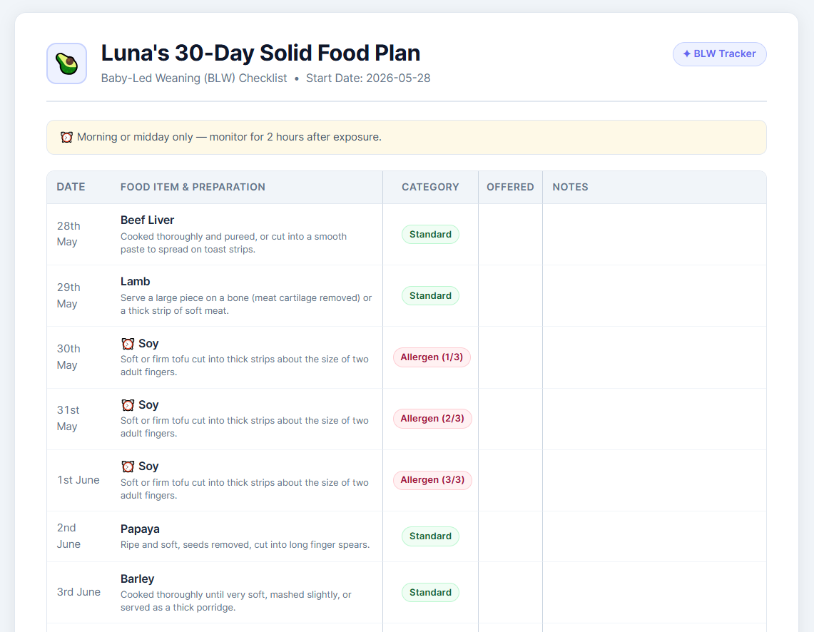
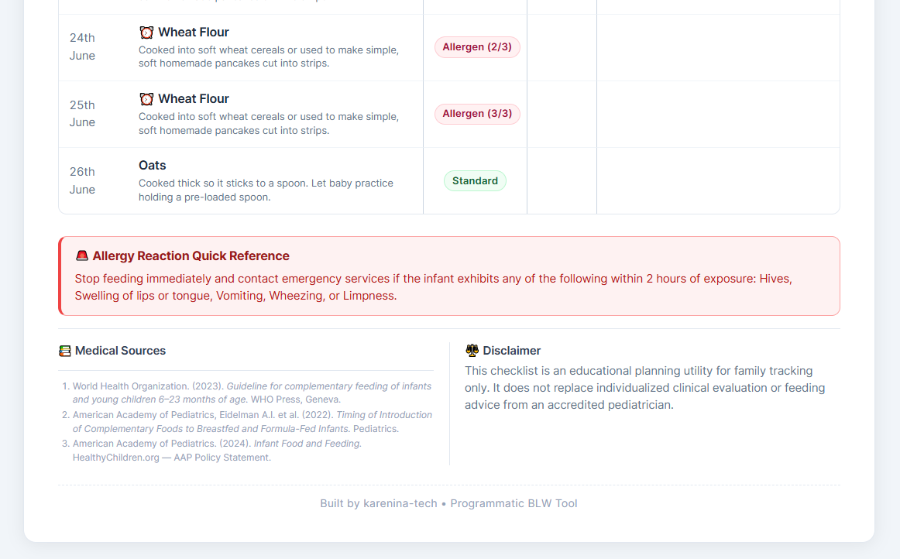

# 🥑 BLW Solids Tracker — Skill

## Motivation

Starting complementary feeding can be overwhelming for first-time parents, especially when implementing the Baby-Led Weaning (BLW) method.

This tool helps parents track the introduction of solid foods in a safe, suggested order. It places special emphasis on tracking **potentially allergenic foods**. By using this tool, parents gain peace of mind and clear visibility into which foods have been offered, which were rejected, and which caused allergic reactions.

<details>
  <summary>📸 Click to view the printable checklist design</summary>
  <br>
  <p><strong>Header & Intro:</strong></p>
  
  <br><br>
  <p><strong>30-Day Tracking Table and Footer:</strong></p>
  
</details>

---

## 👨‍👩‍👧 Not a developer?

If you just want to generate a BLW checklist for your baby — no setup, no AI subscription, no server — use the companion web app instead:

**[🥑 BLW Solids Tracker](https://blw.kareninatech.com)** — open the link, fill in a short form, and download your personalised 30-day checklist. Free, open source, runs entirely in the browser.

---

## Concept

An **agent-agnostic HTTP Skill Server**. Any AI framework (LangChain, Vercel AI SDK, AutoGen, or a custom agent) can connect to it via standard HTTP and JSON Schema — no SDK, no API key required on the server side.

→ **To connect your agent, see [SKILL.md](./SKILL.md).**

---

## 🔌 Connect your agent

There is **no SDK and no vendor lock-in**. The entire contract is three HTTP endpoints plus standard JSON Schema, so any framework can drive it:

- `GET /api/prompt` → returns `{ prompt }`. Load it as your system prompt.
- `GET /api/tools` → returns `{ tools: [...] }`. Each entry has a logical `name` (e.g. `getSafeFoods`), the `endpoint` to POST to (e.g. `/api/tools/get-safe-foods`), a `description`, and a JSON Schema `parameters` object. Note the `name` and the `endpoint` differ — register the schema under `name`, but send the request to `endpoint`.
- `POST <endpoint>` → call the tool with a JSON body matching its `parameters` schema.

The base URL is `http://localhost:3000` (or whatever `PORT` you set). The examples below all do the same thing — fetch the tools and wire them in — in three different stacks.

<details>
<summary><strong>Plain <code>curl</code> — any language</strong></summary>

```bash
# 1. Load the system prompt
curl -s http://localhost:3000/api/prompt

# 2. Discover the tools (name, endpoint, and JSON Schema for each)
curl -s http://localhost:3000/api/tools

# 3. Call a tool — here, the early age-readiness gate
curl -s -X POST http://localhost:3000/api/tools/validate-age \
  -H 'Content-Type: application/json' \
  -d '{
    "ageMonths": 6,
    "developmentalMilestones": {
      "headControl": true,
      "canSitWithMinimalSupport": true,
      "reachAndGrab": true,
      "showsInterestInFood": true
    }
  }'
```

</details>

<details>
<summary><strong>LangChain (Python)</strong></summary>

```python
import requests
from langchain_core.tools import StructuredTool

BASE_URL = "http://localhost:3000"

# Pull the system prompt and tool definitions from the running server
system_prompt = requests.get(f"{BASE_URL}/api/prompt").json()["prompt"]
tool_defs = requests.get(f"{BASE_URL}/api/tools").json()["tools"]

def make_tool(defn):
    def _call(**kwargs):
        res = requests.post(f"{BASE_URL}{defn['endpoint']}", json=kwargs)
        return res.json()

    return StructuredTool.from_function(
        func=_call,
        name=defn["name"],
        description=defn["description"],
        args_schema=defn["parameters"],  # the server's JSON Schema
    )

tools = [make_tool(d) for d in tool_defs]
# Pass `tools` and `system_prompt` to your agent / LLM as usual.
```

</details>

<details>
<summary><strong>Vercel AI SDK (TypeScript)</strong></summary>

```ts
import { generateText, tool, jsonSchema } from 'ai';
import { openai } from '@ai-sdk/openai';

const BASE_URL = 'http://localhost:3000';

const { prompt: system } = await fetch(`${BASE_URL}/api/prompt`).then((r) => r.json());
const { tools: defs } = await fetch(`${BASE_URL}/api/tools`).then((r) => r.json());

const tools = Object.fromEntries(
  defs.map((d: any) => [
    d.name,
    tool({
      description: d.description,
      parameters: jsonSchema(d.parameters), // the server's JSON Schema
      execute: async (args) => {
        const res = await fetch(`${BASE_URL}${d.endpoint}`, {
          method: 'POST',
          headers: { 'Content-Type': 'application/json' },
          body: JSON.stringify(args),
        });
        return res.json();
      },
    }),
  ]),
);

await generateText({ model: openai('gpt-4o'), system, tools, prompt: 'Help me start solids for my baby.' });
```

</details>

These are just three examples — **any** framework that speaks HTTP and JSON Schema works the same way. For the full step-by-step protocol (server startup, the onboarding flow, and the safety gates), see **[SKILL.md](./SKILL.md)**.

---

## ✨ Key Features

- **Agent-agnostic:** Any framework that can read JSON Schema and make HTTP calls works out of the box.
- **Independent safety gates:** Every tool re-validates its own inputs. The server never assumes a previous step was completed.
- **Formula exception at 5 months:** Babies on formula can start early if they pass all physical milestones, matching official pediatric guidance.
- **Diet and allergen filtering:** Foods are filtered by dietary preference (standard / vegetarian / vegan) and any declared allergens before the plan is built.
- **Printable 30-day checklist:** On approval, a `BLW_Fridge_Checklist.html` is generated and served at `/api/checklist`.

---

## 🛠️ Available scripts

| Script | Purpose |
|---|---|
| `npm run dev` | Start the server in watch mode |
| `npm run build` | Compile TypeScript to `dist/` |
| `npm start` | Run the compiled build |
| `npm test` | Run all tests |
| `npm run types` | Type-check without emitting |
| `npm run validate:dataset` | Validate the food dataset against its schema |

---

## ⚠️ Safety notice

- This tool does **not** replace professional medical advice.
- Always consult your pediatrician before starting solids.
- Never leave your baby unattended while eating.
- Prepare all foods in an **age-appropriate size and texture** to prevent choking.
